## Hey, I'm Andrés 👋

**Full Stack Developer | React • Node.js | AI Engineering**

I'm a Full Stack Developer currently deepening my focus on **AI Engineering**.

I'm expanding beyond AI integration to develop a deeper understanding of how AI-powered systems work, how they are designed and built, and how to turn these capabilities into useful software products.

I'm currently working on **AI-powered applications, MCP integrations, and dynamic application platforms**, while exploring how software components can be built, composed, and rendered dynamically at runtime.

### 📚 Currently Learning

- AI Engineering & Machine Learning fundamentals
- Generative AI & LLMs
- AI Systems & Architecture
- Agents & AI-powered workflows
- Retrieval & Knowledge Systems
- Mathematical concepts behind AI

### 🚀 Direction

**From AI Integrator → AI Engineer**

My goal is to combine my software engineering background with a deeper understanding of AI, moving from integrating AI capabilities into applications to being able to **design, build, understand, and explain AI-powered systems end to end.**

# 💻 Tech Stack:
        

## 📊 GitHub Stats:

  
  

